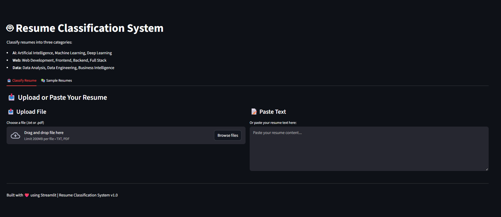
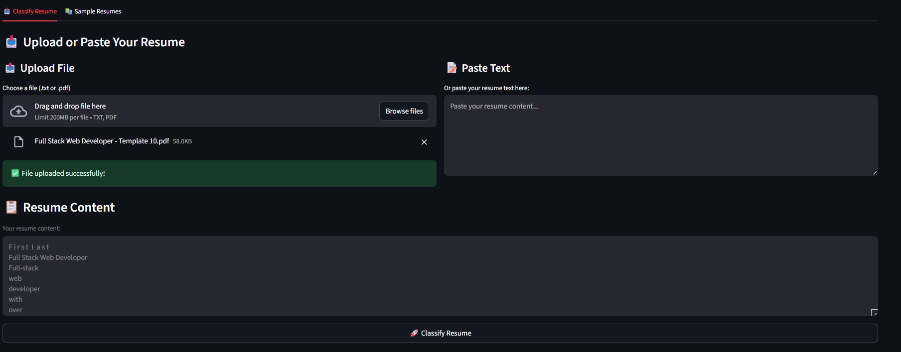
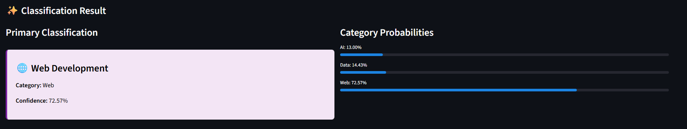
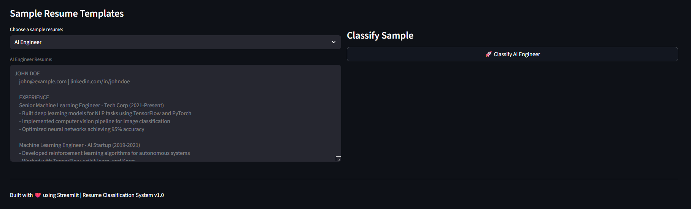
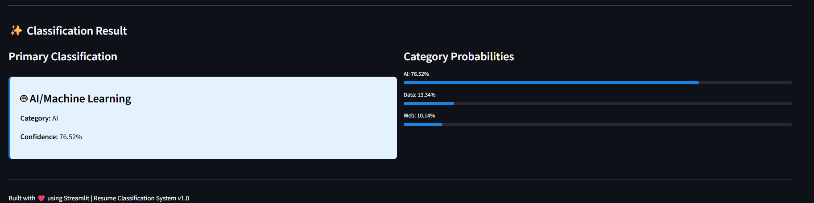

# Resume Classification System

A machine learning-powered Streamlit application that automatically classifies resumes into three categories: **AI**, **Web**, or **Data**.

## 📋 Project Overview

This project uses Natural Language Processing (NLP) and machine learning to analyze resume content and categorize them based on the skills and experience mentioned. The classification is performed using TF-IDF vectorization combined with a Logistic Regression classifier, achieving 84.44% accuracy.

### Categories
- **AI**: Artificial Intelligence, Machine Learning, Deep Learning, Neural Networks
- **Web**: Web Development, Frontend, Backend, Full Stack Development
- **Data**: Data Science, Data Analysis, Data Engineering, Business Intelligence

## 🎯 Features

- **Multiple Input Methods**
  - Paste resume text directly
  - Upload text files (.txt)
  - Test with sample resumes
  
- **Classification Details**
  - Category prediction
  - Confidence score
  - Probability distribution across all categories
  
- **User-Friendly Interface**
  - Clean, intuitive Streamlit web application
  - Real-time classification
  - Visual confidence indicators
  - Color-coded results

## 📊 Model Details

- **Algorithm**: Logistic Regression
- **Feature Extraction**: TF-IDF (Term Frequency-Inverse Document Frequency) with bigrams
- **Accuracy**: 84.44% on test set
- **Training Data**: 150 samples total (50 per category)
- **Max Features**: 3000
- **N-gram Range**: (1, 2) - unigrams and bigrams
- **Framework**: scikit-learn
- **Language**: Python
- **Confidence Scores**: Supported via predict_proba

## 🚀 Quick Start

### Prerequisites
- Python 3.8 or higher
- pip (Python package manager)

### Installation

1. **Clone the repository**
   ```bash
   git clone <repository_url>
   cd resume_classification
   ```

2. **Create a virtual environment**
   ```bash
   python -m venv venv
   source venv/bin/activate  # On Windows: venv\Scripts\activate
   ```

3. **Install dependencies**
   ```bash
   pip install -r requirements.txt
   ```

4. **Train the model**
   ```bash
   python train_model.py
   ```
   This will create a `models/resume_classifier.pkl` file containing the trained model.

5. **Run the Streamlit app**
   ```bash
   streamlit run app.py
   ```

   The app will open in your default browser at `http://localhost:8501`

## 📁 Project Structure

```
resume_classification/
├── app.py                    # Main Streamlit application
├── train_model.py            # Model training script
├── requirements.txt          # Python dependencies
├── README.md                 # Project documentation
├── .gitignore               # Git ignore rules
├── data/                    # Directory for training data (optional)
└── models/                  # Directory storing trained models
    └── resume_classifier.pkl # Trained model file
```

## 📸 Screenshots

### Main Interface

*The main interface showing the classification options and categories*

### Upload/Paste Tab - File Upload

*Uploading a PDF resume file with automatic text extraction*

### Classification Results

*Web Development classification result showing confidence score and category probabilities*

### Sample Resumes Tab

*Sample resumes section with AI Engineer example*

### AI Classification Result

*AI/Machine Learning classification result showing 76.52% confidence*

## 💻 Usage

### Method 1: Paste Resume Text
1. Go to the "📝 Paste Resume" tab
2. Copy and paste your resume content
3. Click "Classify Resume"
4. View the classification result and confidence scores

### Method 2: Upload File
1. Go to the "📤 Upload File" tab
2. Upload a .txt file containing your resume
3. Click "Classify Uploaded Resume"
4. View the results

### Method 3: Test with Samples
1. Go to the "📋 Sample Resumes" tab
2. Select a sample resume from the dropdown
3. Click "Classify Sample Resume"
4. Observe how the model classifies different resume types

## 🔧 Development

### Training a Custom Model

To retrain the model with your own data, modify the `training_data` dictionary in `train_model.py`:

```python
training_data = {
    'AI': [list of AI resumes/descriptions],
    'Web': [list of Web resumes/descriptions],
    'Data': [list of Data resumes/descriptions]
}
```

Then run:
```bash
python train_model.py
```

## 📦 Dependencies

- **streamlit**: Web application framework for machine learning apps
- **scikit-learn**: Machine learning library for classification
- **numpy**: Numerical computing library
- **pandas**: Data manipulation and analysis library

## 🎓 How It Works

1. **Text Preprocessing**: Resume text is cleaned and tokenized
2. **Feature Extraction**: TF-IDF vectorizer (with unigrams and bigrams) converts text into 3000 numerical features
3. **Classification**: Logistic Regression classifier predicts the category with probability estimates
4. **Confidence Scoring**: Probability scores are calculated for each category using predict_proba
5. **Pipeline**: Text vectorization and classification happen in a single scikit-learn Pipeline

## 📈 Model Performance

**Overall Accuracy**: 84.44%

**Per-Category Performance**:
- **AI**: 100% precision, 73% recall, 85% F1-score
- **Data**: 82% precision, 93% recall, 88% F1-score
- **Web**: 76% precision, 87% recall, 81% F1-score

**Training Data**: 150 samples total (50 per category) with distinctive keywords:
- AI: Machine Learning, Neural Networks, TensorFlow, PyTorch, NLP, Computer Vision, Deep Learning
- Web: React, Node.js, Frontend, Backend, JavaScript, TypeScript, REST APIs, Docker, Kubernetes
- Data: SQL, Python, Data Analysis, Tableau, Power BI, ETL, Apache Spark, Analytics

## 🚢 Deployment

### Deploy on Streamlit Cloud

1. Push your code to GitHub
2. Visit [Streamlit Cloud](https://streamlit.io/cloud)
3. Click "New app" and select your repository
4. Configure the app settings
5. Deploy!

### Deploy on Other Platforms

- **Heroku**: Use `Procfile` and buildpacks
- **AWS EC2**: Run with Nginx reverse proxy
- **Docker**: Containerize the application

## 📝 Example

**Input Resume:**
```
Full Stack Developer with expertise in React, Node.js, MongoDB.
Built responsive web applications using HTML5, CSS3, JavaScript.
Experience with Redux for state management and REST APIs.
```

**Output:**
```
Category: Web
Confidence: 95.3%
Probabilities:
- Web: 95.3%
- AI: 3.2%
- Data: 1.5%
```

## 🤝 Contributing

Contributions are welcome! To improve the model:

1. Add more training samples for each category
2. Experiment with different vectorizers (CountVectorizer, Word2Vec)
3. Try different classifiers (SVM, Random Forest, etc.)
4. Optimize hyperparameters

## 📄 License

This project is open source and available under the MIT License.

## 📧 Contact

For questions or suggestions, feel free to reach out!

## 🎉 Acknowledgments

- Built with [Streamlit](https://streamlit.io/)
- Machine learning powered by [scikit-learn](https://scikit-learn.org/)
- NLP techniques from [Natural Language Toolkit](https://www.nltk.org/)

---

**Submission Deadline**: Friday, 8 PM  
**Last Updated**: November 25, 2025
